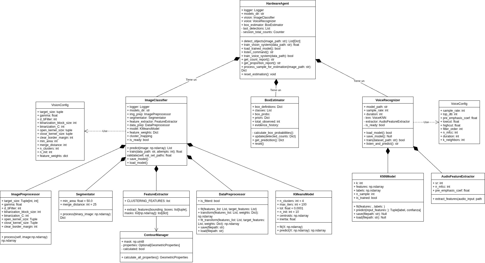
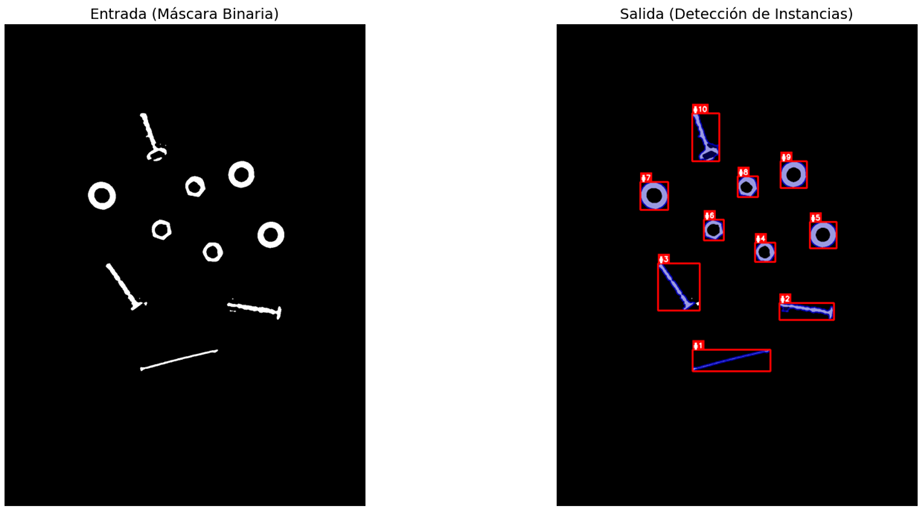
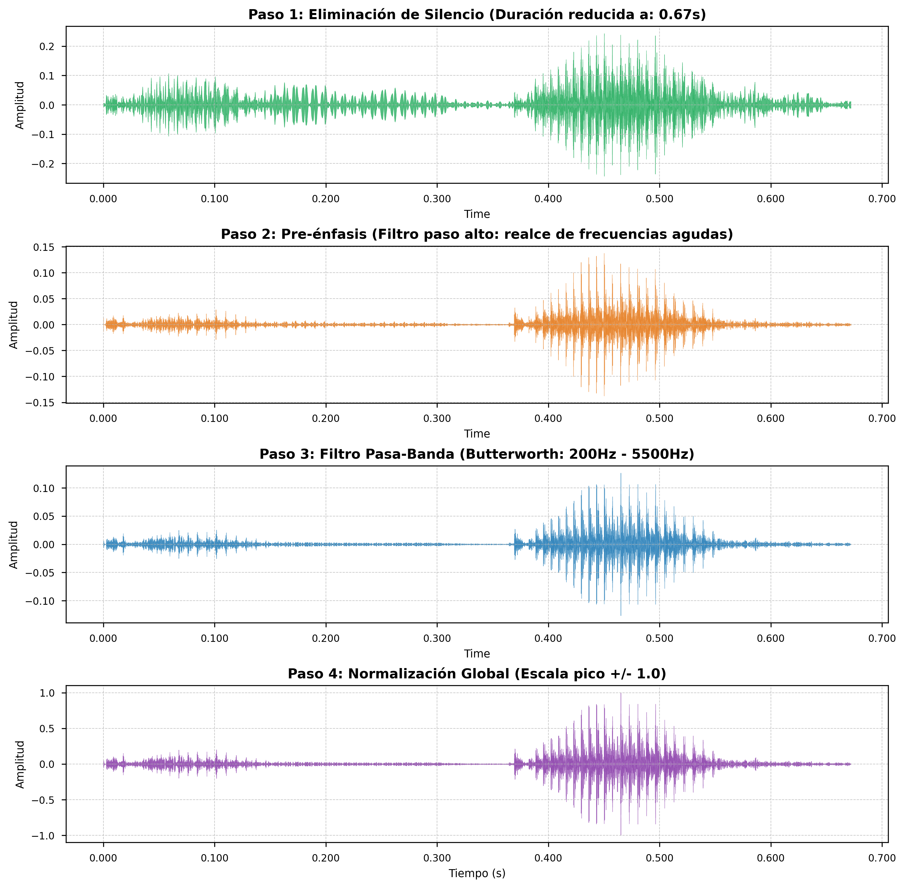

# Clasificador de Piezas Industriales: Agente de IA Multimodal

## 📌 Overview y Propuesta de Valor
En entornosde producción industrial, el control de inventario a granel presenta un desafío de incertidumbre y eficiencia.
Este proyecto implementa un sistema automatizado capaz de estimar la distribución proporcional de piezas mecánicas (tornillos, tuercas, arandelas y clavos) en cajas de 100 unidades, utilizando unicamente una muestra aleatoria de 10 piezas.

El sistema integra tres pilares tecnológicos para lograr una operación *hands-free* y altamente confiable
* **Vision Artificial**: Percibe y extrae métricas geométricas de las piezas.
* **Reconocimiento de Voz**: Permite la interacción natural del operario mediante comandos auditivos.
* **Motor de Inferencia Bayesiana**: Razona bajo incertidumbre para extrapolar los datos de la muestra y predecir el contenido total.

## 🎥 Demo del Sistema

## 🏗️ Arquitectura del Sistema

El sistema está diseñado bajo el paradigma de Programación Orientada a Obejtos (OOP), implementando una arquitectura de **Agente Basado en Modelos**

* **HardwareAgent (Orquestador Central)**: Actúa como el núclo lógico, sincronizando los subsistemas y manteniendo el estado interno de las detecciones. Separa estrictamente la lógica de negocio de la interfaz gráfica.
* **Patrón Facade**: La complejidad del procesamiento de imágenes y señales de audio se oculta detrás de interfaces unificadas ("ImageClassifier" y "VoiceRecognizer").
* **Inyección de Dependencias**: La configuración de hiperparámetros se desacopla utilizando clases inmutables ("VisionConfig" y "VoiceConfig"), garantizando escalabilidad y fácil mantenimiento.

## 🧠 Pipeline de Inteligencia Artificial

### 1. Subsistema de Visión Artificial (K-Means)
* **Preprocesamiento**: Conversión a escala de grises, normalización espacial, corrección Gamma, filtrado bilateral para preservación de bordes y binarización adaptativa.

* **Extracción de Características**: Transformación a un vector maximizando la distancia interclase. Se utilizan métricas clave como **Relación de Aspecto** (Aspect Ratio), **Solidez** (Solidity), **Factor de Hueco** (Hole Confidence), **Relación Circular** (Circle Ratio) y **Varianza Radial** (Circular Variance).

* **Clasificación**: Agrupamiento en 4 clústeres mediante el algoritmo **K-Means**, con preprocesamiento previo de estandarización (Z-Score) y ponderación de atributos.

### 2. Subsistema de Voz (K-Nearest Neighbors)
Este subsistema se encarga de tomar un comando de voz, procesarlo y utilizando el algorirmo K-NN clasificarlo entre los comandos validos "propoción", "contar", "salir", agregando a las clases "ruido" para mejorar la precisión del modelo.

Este proceso se realiza a través de las siguientes etapas:

* **DSP y Acondicionamiento**: Eliminación de silencios (Trimming), pre-énfasis para realzar frecuencias agudas, filtrado pasa-banda (200Hz - 5500Hz) y normalización.

* **Extracción de Huella Sonora**: Pooling de 13 coeficientes Mel-Frequency Cepstral Coefficients (MFCC), Zero Crossing Rate (ZCR) y Energía RMS.

* **Clasificación**: Algoritmo **K-NN** ($K=4$) con votación por mayoría y estimación de confianza para validar comandos de acción.

### 3. Estimador Bayesiano
Implementa un filtro recursivo que actualiza la probabilidad de 4 hipótesis de caja (Perfiles A, B, C, D) basándoseen la evidencia visual acumulada.
Opera matemáticamente en **dominio logarítmico (Log-Sum-Exp)** para garantizar estabilidad numérica, e integra un factor de suavizado probabilistico para tolerar falsos positivos aislados del sensor óptico.
